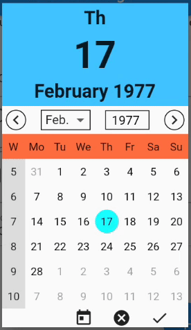

# Flutter Input Widgets - Standalone or within a Form &rarr; _flutter_input_
This package provides input widgets (fields) to manipulate data.
The data to manipulate is either a single variable or an entry in a `map`.
The map can even be nested.
Parameter `path` defines the key to access the entry in the map.

All input widgets share a common set of parameters and methods.
A list of validators can be attached to each input widget.

Each input widget can be used standalone.
If it finds a `InputForm` ancestor then it will automatically
register itself to the form.
The form provides methods to `enable()`, `reset()`, `save()`
or `validate()` all fields at once.

## Input Widgets
The following input widgets are available.
See section _Development_ below for building your own input widget.
* `InputCheckbox` - Checkbox for data type `bool`
* `InputCountry` - Dropdown to select a country (shows flags)
* `InputDate` - Calendar based selection for data type `DateTime` (date part only)
* `InputDatePicker` - A highly customizable date picker with week of year and multiple swipe actions 
* `InputDateTime` - Wheels for data type `DateTime` can be customized for date only, time only or both
* `InputDropDown<T>` - Dropdown button for data type `T`
* `InputFavorite` - A favorite button with selectable icon for data type `bool`
* `InputKeyboard` - Text input for data type `String`, `int` or `double`
* `InputLanguage` - Dropdown to select a language (`Locale`)
* `InputPassword` - Text field with a switch to make obscured input visible (`String`)
* `InputRadio<T>` - Radio button to select one value of type `T`
* `InputRating` - Rating widget with selectable icons and a range slider for data type `int`
* `InputSlider` - Slider for data type `double` between a minimum and maximum value
* `InputSpinner` - Spinner with buttons for data type `double` to decrease or increase a value
 between a minimum and maximum
* `InputSwitch` - Switch for data type `bool`

### Common Parameters

All input widgets share a common set of parameters.
All parameters are named and optional.

* `Key key` - Identifier for the field
* `bool autosave = true` - automatically saves any changed value.
If `autovalidate is true` then the value will only be changed
when there are no validation failures.
* `bool autovalidate = false` - automatically validates changed values
* `InputDecoration decoration` - e.g. for a label (see example)
* `bool enabled` - to enable or disable user input.
If not set then uses setting from `InputForm`
or defaults to `true` (if there is no form).
* `T initialValue` - sets the fields initial value.
Overrides using the value from `map`.
* `ValueSetter<T> onChanged` - invoked on every change
 of the input field value
* `ValueSetter<T> onSaved` - invoked by `save()` which
will be automatically called by `InputForm.save()`.
* `String path` - to access the value in `map`
* `List<InputValidator> validators` - list of validators

### Validators
The following validators can be given to parameter `validators`
of an input widget. Each validator accepts the optional parameter
`message` to set an individual error message if the validation fails.
* `after(DateTime date)` - validates that the field value
 is after `date`
* `before(DateTime date)` - validates that the field value
 is before `date`
* `future` - validates that the DateTime field value
 lies in the future
* `max(num maxVal)` - validates that the num field value
 is not larger than `maxVal` 
* `maxLen(num maxLen)` - validates that the length of the String
 field value is not longer than `maxLen` 
* `min(num minVal)` - validates that the num field value
 is not smaller than `minVal` 
* `minLen(num minLen)` - validates that the length of the String
 field value is not shorter than `minLen` 
* `notNull` - validates the the field value is not empty
* `past` - validates that the DateTime field value
 lies in the past

### Usage

Each input widget will automatically register itself if it
finds an `InputForm` ancestor.
Otherwise it will just run standalone.
It will use `initialValue` for its value to display.
If `initialValue is null` then it will use the value from
`map[path]` if both are set.
If `map` is not set, then the field will use `map` from
an `InputForm` ancestor (if there is any).

Saving a modified value will happen
* on any change if `autosave = true` (which is the default)
* when `save()` is called
* when `save()` is called on the `InputFormState`

The changed value will be written to the `map` at `path`
if both were supplied. Also method `onSave()` will be invoked
with the changed value.

### Demo

For a complete example see `example/main.dart`.

#### InputDatePicker
The highly customizable `InputDatePicker` allows you to choose a date
from a calendar page which also shows the week of the year.
It provides spinners, swipes and a dropdown to select the month.
The year can even be entered as text.
All parts can be customized by `DatePickerStyles`.
 

## Development
To create a new input field for data type `T` follow these steps:
1. Copy one of the included class files.
1. Rename the class widget and its state to your new one. 
1. Replace `T` with the value type of your new input field.
1. Adapt parameters and leave the call to `super()` with
 all the common parameters.
1. Adapt method `build( BuildContext context)` in the state class.
 It must end with `return super.buildInputField( context, ...` where
 `...` is the code to display your new field widget.

## Utilities
This package also contains some utilities.

* `InputUtils.convertToType()` converts a value to a given target type.
* `InputUtils.readFromJson()` reads a value from a nested map.
* `InputUtils.writeToJson()` writes a value into a nested map.
* See `date_helper.dart` for extensions on `DateTime`
 for `weekOfYear`, `julianDay` and more.

### To Do
* \[X\] create a customizable calendar picker with week numbers
* \[X\] create a text input field for int and double
* \[ \] create an input widget for a calendar with events
* \[ \] create an input widget to select multiple choices like a
 multi-select list
* \[ \] add some images to this documentation
* \[X\] internationalize the whole package
* \[X\] create an input widget to change the language within the app 
